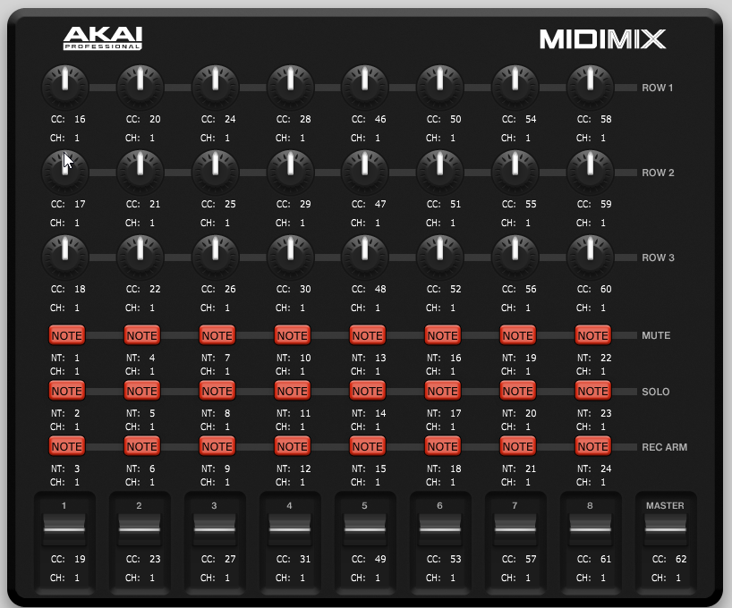
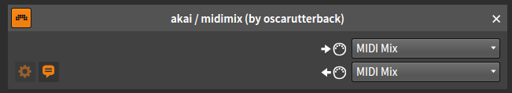

# Akai Midimix controller script

## Installation
Install the script by copying target/midimix.bwextension to your Bitwig Studio/Extensions folder.

The script is configured according to the following controller map.

You can find the midimix editor software [here](http://www.akaipro.com/products/recording/midimix).

Add you controller manually in bitwig:

It should work immediately.

## Functionality
The functionality is made to closely resemble the Ableton Live functionality. The Midimix controller maps 8 channels from left to right, and gives you access to sends 1 and 2, pan, mute, solo, arm and volume of each track. The Send All button transmits all settings from the controller as if each controller was activated. The script maps all tracks: Instruments, groups, audio, sends and master.
 
 ## Bugs
 * The group master of a track group ends up as the last track of the group on the Midimix. It should probably be the first.
 * If you have less than 8 tracks, the master track will take up one of the channel slots, effectively giving you two volume faders but also solo and pan control of the master track. I probably won't fix this.

