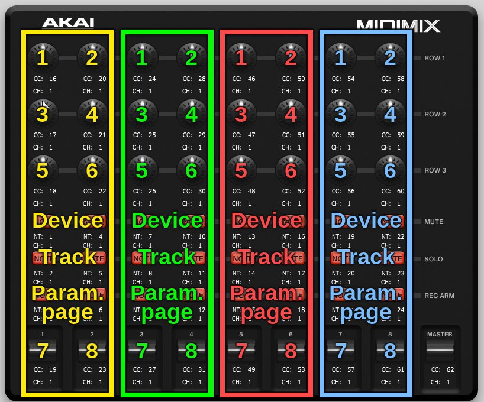

# Akai Midimix controller script

## Installation
Install the script by copying [midimix.bwextension](./target/midimix.bwextension) to your Bitwig Studio/Extensions folder.

The script is configured according to the following controller map.

You can find the midimix editor software [here](http://www.akaipro.com/products/recording/midimix).

Add your controller manually in bitwig:

It should work immediately.

## Functionality
There are two modes available, a mixer mode, and a multi device control mode, that work completely independently of each other. They are described below. 

### Switching Modes
To switch between the two modes, hold Solo and press Bank Left or Bank Right. Solo + Bank Left activates the mixer mode, Solo + Bank Right activates the multi device mode.

### Mixer mode
This mode will be familiar to Ableton Live users. The Midimix controller maps 8 channels from left to right, and gives you access to sends 1 and 2, pan, mute, solo, arm and volume of each track. 

The Send All button transmits all settings from the controller as if each controller was activated. 

Due to a bug/feature in how Bitwig's TrackBank works, the controller will only map to main tracks, i.e. no send or master tracks.

A popup notification is displayed when the Bank Left and Right buttons are pressed, indicating  which track corresponds to the first channel on the controller. The channels are numbered 1 through 8 from left to right. 

 
 ### Multi device controller
 The multi device mode divides the midimix into four separate controllers. Two columns on the midimix map to a single device controller as described in the image below. The buttons for each device controller navigates between tracks, devices and parameter pages, and the chosen parameter page automatically maps to the 8 parameters of the active parameter page. When the user changes track, device, or parameter page, a popup will display info about the chosen controller.
 
 The controllers are labelled 1 through 4 from left to right. The left hand buttons on each controller selects the previous track, device or parameter page, while the right hand selects the next.
 
 The master fader is not in use in this mode. Map it to something fun manually.
  
 
 
 
 Thanks to [Adam Näslund](https://github.com/kattfisk) for the image.
 
 ## Bugs of the known kind
 * If you have less than 8 tracks, the master track will take up one of the channel slots, effectively giving you two volume faders but also solo and pan control of the master track. I probably won't fix this.

